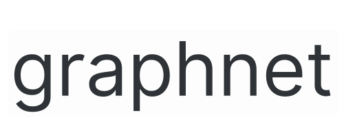

<h1 align="center">

</h1>

**graphnet** is an open repository for graphs.


## Features

### Graph Algorithms

| **Search** | **Shortest Path** | **Minimum Spanning Tree** | **Connectivity** | **Topological Sort** | **Matching** | **Graph Coloring** | **Planarity Test** | **Graph Partitioning** |
|------------|-------------------|---------------------------|-------------------|----------------------|--------------|--------------------|---------------------|------------------------|
| - [x] Depth First Search | - [x] Dijkstra | - [x] Prim | - [x] Union Find | - [x] Kahn | - [x] Hopcroft-Karp | - [x] Greedy | - [x] Boyer-Myrvold | - [x] Kernighan-Lin |
| - [x] Breadth First Search | - [x] Bellman-Ford | - [x] Kruskal | | - [x] DFS | | - [x] Welsh-Powell | | | |

### Graph Models

| **Random Graph** | **Geometric Graph** | **Grid Graph** | **Tree Graph** | **Regular Graph** | **Power Law Graph** | **Small World Graph** | **Community Graph** |
|------------------|---------------------|-----------------|-----------------|---------------------|----------------------|------------------------|----------------------|
| - [x] Erdos-Renyi | - [x] Random Geometric | - [x] Grid | - [x] Random Tree | - [x] Regular | - [x] Power Law | - [x] Small World | - [x] LFR |

### Graph Analysis

| **Graph Metrics** | **Graph Properties** | **Graph Centrality** | **Graph Similarity** | **Graph Embedding** | **Graph Visualization** |
|-------------------|----------------------|-----------------------|----------------------|----------------------|-------------------------|
| - [x] Degree | - [x] Connected | - [x] Degree Centrality | - [x] Graph Edit Distance | - [x] DeepWalk | - [x] Force Atlas |
| - [x] Diameter | - [x] Bipartite | - [x] Closeness Centrality | | - [x] Node2Vec | - [x] Fruchterman-Reingold |
| - [x] Radius | - [x] Eulerian | - [x] Betweenness Centrality | | | |
| - [x] Center | - [x] Hamiltonian | - [x] Eigenvector Centrality | | | |
| - [x] Periphery | - [x] Planar | | | | |
| - [x] Girth | - [x] Regular | | | | |
| - [x] Density | - [x] Complete | | | | |
| - [x] Clustering Coefficient | - [x] Tree | | | | |

### Theorems and Proofs

| **Graph Theory** | **Graph Algorithms** |
|-------------------|-----------------------|
| - [x] Euler's Theorem | - [x] Dijkstra's Algorithm |
| - [x] Hamiltonian Cycle | - [x] Bellman-Ford Algorithm |
| - [x] Kuratowski's Theorem | - [x] Floyd-Warshall Algorithm |
| - [x] Planar Graph | - [x] Prim's Algorithm |
| - [x] Graph Coloring | - [x] Kruskal's Algorithm |
| - [x] Graph Isomorphism | - [x] Kahn's Algorithm |
| | - [x] Hopcroft-Karp Algorithm |
| | - [x] Kernighan-Lin Algorithm |

### Real World Graphs

| **Social Networks** | **Web Graphs** | **Transportation Networks** | **Biological Networks** | **Information Networks** | **Technological Networks** | **Economic Networks** | **Ecological Networks** |
|---------------------|----------------|-----------------------------|-------------------------|--------------------------|---------------------------|-----------------------|-------------------------|
| - [x] Facebook | - [x] Google | - [x] Road | - [x] Protein-Protein | - [x] Citation | - [x] Power Grid | - [x] Trade | - [x] Food Web |
| - [x] Twitter | - [x] Bing | - [x] Rail | - [x] Metabolic | - [x] Co-Purchase | - [x] Internet | - [x] Stock Market | - [x] Mutualistic |
| - [x] Instagram | - [x] Yahoo | - [x] Air | - [x] Gene Regulatory | - [x] Co-Authorship | - [x] Telephone | - [x] Input-Output | - [x] Competitive |
| - [x] Youtube | | - [x] Sea | - [x] Neural | - [x] Co-Occurrence | - [x] Mobile | | - [x] Host-Parasite |
| - [x] Reddit | | | - [x] Food Web | | - [x] Wireless | | | |
| - [x] Pinterest | | | - [x] Brain | | - [x] Sensor | | | |
| - [x] LinkedIn | | | - [x] Disease | | | | | |
| - [x] Github | | | - [x] Ecological | | | | | |
| - [x] StackOverflow | | | - [x] Epidemiological | | | | | |
| - [x] Wikipedia | | | - [x] Molecular | | | | | |
| - [x] Amazon | | | - [x] Pharmacological | | | | | |
| - [x] Netflix | | | | | | | | |
| - [x] Spotify | | | | | | | | |

### Graph Neural Networks

| **Graph Convolutional Network** | **Graph Autoencoder** | **Graph Generative Model** | **Graph Embedding** |
|---------------------------------|------------------------|-----------------------------|----------------------|
| - [x] GCN | - [x] Graph Autoencoder | - [x] GraphRNN | - [x] DeepWalk |
| - [x] GAT | - [x] Variational Graph Autoencoder | - [x] GraphVAE | - [x] Node2Vec |
| - [x] GraphSAGE | - [x] Adversarial Graph Autoencoder | - [x] Graphite | |
| - [x] GIN | | - [x] Graph Convolutional Generative Adversarial Network | |
| - [x] Graph Attention Pooling | | | |
| - [x] Graph U-Net | | | |
| - [x] Graph Isomorphism Network | | | |
| - [x] Graph Neural Network | | | |
| - [x] Graph Convolutional Policy Network | | | |
| - [x] Graph Convolutional Reinforcement Learning | | | |


## Local Installation

```bash
sudo apt-get install ffmpeg
pip install -r requirements.txt
```